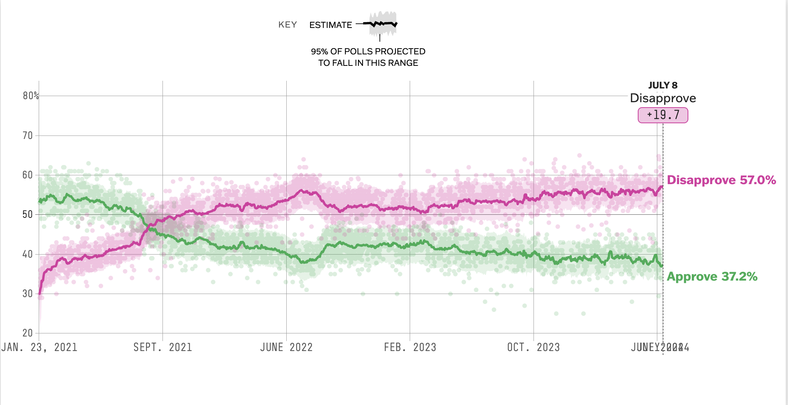

## Find a graph to reproduce

The graph I decide to reproduce is a biden approval rating from the 538 website:

<https://projects.fivethirtyeight.com/biden-approval-rating/>

Here is a photo of what I am attempting to recreate:



### Setup

```{r}
# This chunk is used to load in the packages need for this assignment

library(here)
library(readr)
library(gridExtra)
library(grid)
library(ggplot2)
library(dplyr)
library(zoo)
library(plotly)
library(gt)
```

### Get the data

```{r}
# This chunk is used to load in the data, the data will be saved into a variable named 'data'

data_location <- here::here("presentation-exercise", "data", "president_approval_polls.csv")

# Load the dataset
data <- read_csv(data_location)

# Convert start_date to Date type
data$start_date <- as.Date(data$start_date, format = "%m/%d/%Y")
```

### Ask AI to re-create the original graph

Here is the prompt I used to generate the code needed to recreate the graph I choose. I used ChatGPT 4o and provided a picture of the graph as well as the dataset:

"How can i go about recreating this graph using the attached dataset"

It went through many iterations until it outputted the following graph:


From this graph I made modifications on my own to make it more similar to the original graph. I added the 'plotly' package in order to make the graph interactive like the original. I also modified the rolling averages to make the lines a bit smoother so it would resemble the original graph more closely. I was also wanting to add the confidence intervals to the graph, however I am unsure if I went about it correctly, I could have asked the AI to add this as well but I wanted to see if I could do it on my own. More of the prompts and AI code can be seen in the visualization-exercise.qmd on github. Below is my final code and graph:

```{r}
# Calculate rolling averages and standard deviations
data <- data %>%
  mutate(approve_smooth = rollmean(yes, 30, fill = NA, align = 'right'),
         disapprove_smooth = rollmean(no, 30, fill = NA, align = 'right'),
         approve_std = rollapply(yes, 30, sd, fill = NA, align = 'right'),
         disapprove_std = rollapply(no, 30, sd, fill = NA, align = 'right'))

# Calculate confidence intervals
data <- data %>%
  mutate(approve_ci = 1.96 * (approve_std / sqrt(7)),
         disapprove_ci = 1.96 * (disapprove_std / sqrt(7)))

data <- data %>%
  filter(!is.na(approve_smooth) | !is.na(disapprove_smooth))


# Plot the graph
fig <- plot_ly(data, x = ~start_date) %>%
  add_ribbons(ymin = ~approve_smooth - approve_ci, ymax = ~approve_smooth + approve_ci,
              line = list(color = 'rgba(0,100,80,0.2)'),
              fillcolor = 'rgba(0,100,80,0.2)',
              name = 'Approval CI',
              hovertemplate = paste('%{y:.2f}%')) %>%
  add_ribbons(ymin = ~disapprove_smooth - disapprove_ci, ymax = ~disapprove_smooth + disapprove_ci,
              line = list(color = 'rgba(160,32,240,0.2)'),
              fillcolor = 'rgba(160,32,240,0.2)',
              name = 'Disapproval CI',
              hovertemplate = paste('%{y:.2f}%')) %>%
  add_lines(y = ~approve_smooth, name = 'Approval', line = list(color = 'green'),
            hovertemplate = paste('Approval: %{y:.2f}%<extra></extra>')) %>%
  add_lines(y = ~disapprove_smooth, name = 'Disapproval', line = list(color = 'purple'),
            hovertemplate = paste('Disapproval: %{y:.2f}%<extra></extra>')) %>%
  layout(title = 'Presidential Approval and Disapproval Ratings',
         xaxis = list(title = 'Date', tickformat = "%b %Y"),
         yaxis = list(title = 'Percentage', range = c(20, 80)),
         hovermode = 'x unified')

fig

```

## Create a publication quality table

I took a sample of the original dataset and had the AI create a publication quality table using said sample, below is the prompt and output. More can be seen in the visualization-exercise.qmd

**Prompt:\
**"Using this same data, how would i go about creating a publication quality table using the gt package in R"

**Output:**

```{r}
# Create a sample data frame similar to the one in the image
data <- data.frame(
  Dates = c("Jun. 30-Jul. 2", "Jun. 29-Jul. 2", "Jun. 28-Jul. 2", "Jun. 28-Jul. 1", "Jun. 28-30", "Jun. 28-30", "Jun. 28-30", "Jun. 28-30", "Jun. 1-30"),
  Sample = c("1,608A", "1,500RV", "1,235RV", "1,754A", "2,090RV", "1,000RV", "1,274RV", "1,500RV", "2,988RV"),
  Pollster = c("YouGov", "Fabrizio, Lee & Associates/GBAO", "The New York Times/Siena College", "YouGov", "Harris Insights & Analytics", "Suffolk University", "CNN", "Harris Insights & Analytics", "ActiVote"),
  Weight = c(0.61, 1.07, 0.69, 0.63, 0.89, 0.87, 0.98, 0.76, 1.51),
  Approval = c(37, 39, 34, 38, 40, 41, 36, 38, 38),
  Disapproval = c(57, 60, 62, 57, 57, 57, 64, 57, 55),
  Adjusted_Approval = c(37, 38, 35, 38, 37, 41, 34, 35, 38),
  Adjusted_Disapproval = c(58, 58, 60, 58, 57, 55, 60, 57, 55),
  Net_Approval = c("Disapprove+21", "Disapprove+20", "Disapprove+24", "Disapprove+20", "Disapprove+20", "Disapprove+14", "Disapprove+27", "Disapprove+22", "Disapprove+17")
)

# Convert Approval and Disapproval values to proportions
data <- data %>%
  mutate(
    Approval = Approval / 100,
    Disapproval = Disapproval / 100,
    Adjusted_Approval = Adjusted_Approval / 100,
    Adjusted_Disapproval = Adjusted_Disapproval / 100
  )

# Create the table using gt
table <- gt(data) %>%
  tab_header(
    title = "Presidential Approval and Disapproval Ratings",
    subtitle = "Poll Summary"
  ) %>%
  cols_label(
    Dates = "DATES",
    Sample = "SAMPLE",
    Pollster = "POLLSTER",
    Weight = "WEIGHT",
    Approval = "RESULT (APPROVAL)",
    Disapproval = "RESULT (DISAPPROVAL)",
    Adjusted_Approval = "ADJUSTED (APPROVAL)",
    Adjusted_Disapproval = "ADJUSTED (DISAPPROVAL)",
    Net_Approval = "ADJUSTED NET APPROVAL"
  ) %>%
  cols_align(
    align = "center",
    columns = everything()
  ) %>%
  fmt_percent(
    columns = vars(Approval, Disapproval, Adjusted_Approval, Adjusted_Disapproval),
    decimals = 0
  ) %>%
  tab_options(
    table.width = pct(100),
    column_labels.font.size = 12,
    table.font.size = 12,
    heading.title.font.size = 14,
    heading.subtitle.font.size = 12
  ) %>%
  data_color(
    columns = vars(Approval, Disapproval, Adjusted_Approval, Adjusted_Disapproval),
    colors = scales::col_numeric(
      palette = c("green", "white", "red"),
      domain = c(0, 1)
    )
  )

# Print the table
table

```
